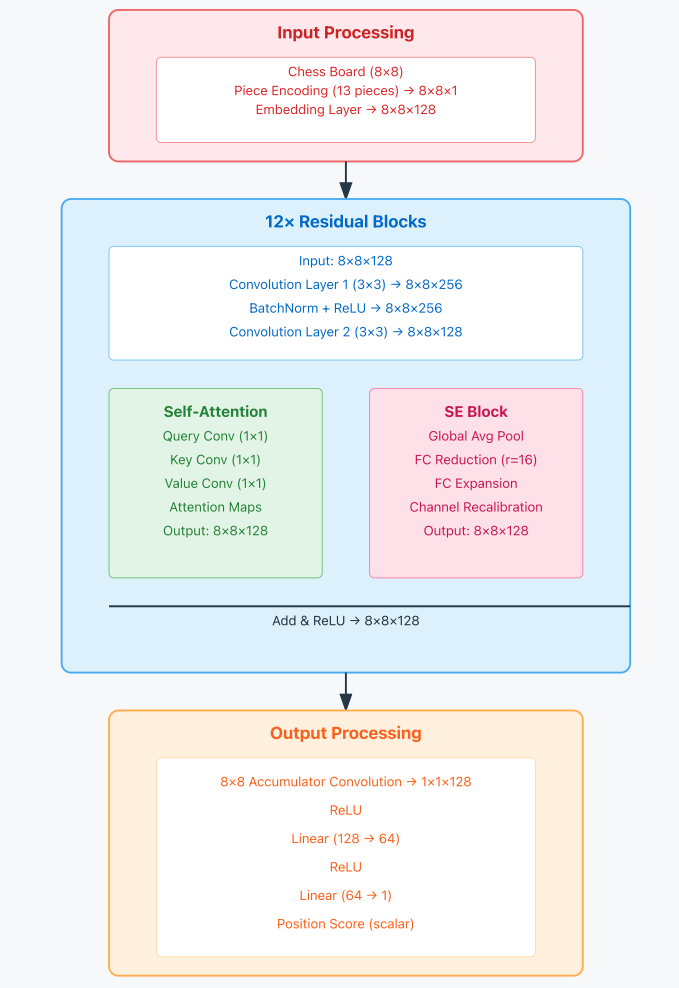

# Chess-GPU-Hackathon-Strong-Compute
Codebase developed to train deep learning to play Chess during the 5th Chess GPU Hackathon organized by Strong Compute

# Team: THETA HAT
### Gopi Maguluri
### Venkatachalam Subramanian Periya Subbu

### [Download the model from here](https://drive.google.com/file/d/1YGw2ALPADgDksUJsQrTEXxSHVNf-L3EN/view?usp=sharing)

### [Here is a demo video](https://drive.google.com/file/d/1NjxraVBCrHRyEOtKoU4VkW28or7WkpUj/view?usp=drive_link)

# Model architecture

